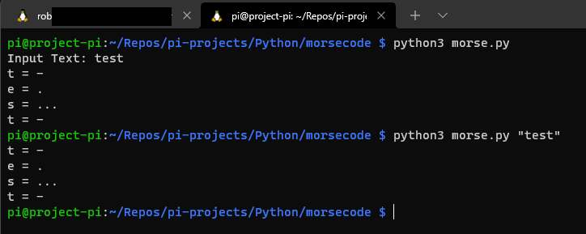

# Morse Code

Code: Python

---
## Description
Project started out as a simple encoder to convert text input to morse code strings. I then expanded to build a basic Raspberry Pi project board with an LED and GPIO.
The Raspberry Pi standard image contains gpiozero already, if you aren't using this you will need to pip install this repository.

---
## Declaration
```python
#import LED function from gpiozero module: https://github.com/gpiozero/gpiozero
from gpiozero import LED
#import sleep for timings
from time import sleep
```

---
## Process
Simple string input is then iterated over a letter at a time, an if statement is used to check against the keys in the morse dictionary and returns the value. 
The returned value from the morse code string is then sent to the pi project board.

## cli output
During development I output the text and morse key side by side as they are being output to the led. 
I've also expanded the project to take an input argument string and perform the same execution.


